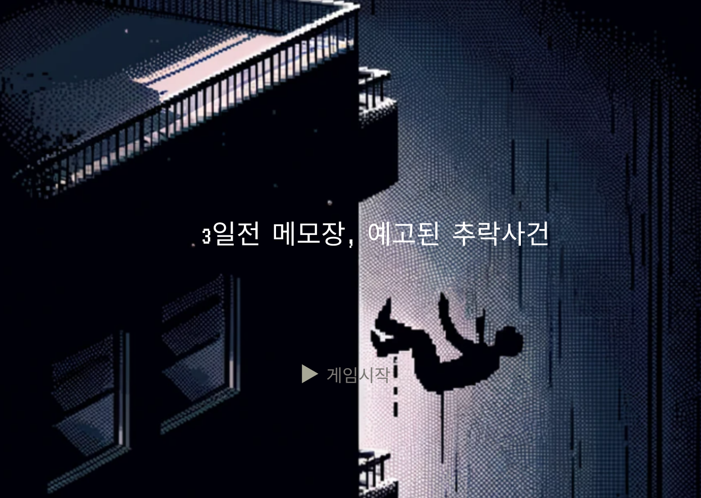
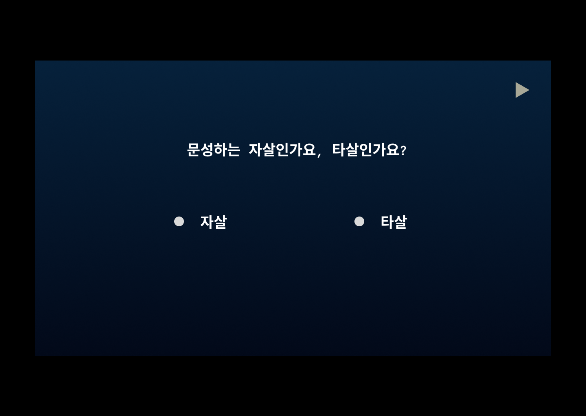

# Memo from 3 Days Ago
### 3일 전 메모장: 예고된 추락 사건

---

## 📖 프로젝트 소개
"Memo from 3 Days Ago"는 추리와 퍼즐 요소가 결합된 스토리 중심의 게임입니다.  
플레이어는 다양한 장면을 탐색하며 단서를 모으고, 선택을 통해 사건의 진실에 다가갑니다.  
각 선택은 이야기의 방향과 결말에 영향을 미치며, 깊이 있는 몰입감을 제공합니다.

<br>
<br>

---

## 🎯 제작 동기
이 프로젝트는 인터랙티브한 스토리텔링과 게임의 결합에 대한 열정에서 시작되었습니다.  
플레이어의 선택이 실질적인 영향을 미치는 게임을 만들어보고 싶었습니다.  
또한, 새로운 기술적 도전과 창의적인 협업을 통해 역량을 확장하는 것이 목표였습니다.


<br>
<br>

---

## 🚀 주요 기능
- 몰입감 있는 스토리: 선택에 따라 변화하는 이야기와 다양한 결말.
- 역동적인 선택: 게임 진행 중 실시간으로 결정을 내릴 수 있음.
- 커스텀 사운드트랙: 게임의 몰입감을 더하는 배경음악.
- 인터랙티브한 게임플레이: 단서를 탐색하고, 선택하여 이야기를 진행.

<br>
<br>

---

## 🖼️ 게임 화면




<br>
<br>

---

## 🛠️ 설치 및 실행 방법
### 1. 프로젝트 다운로드
프로젝트를 다운로드하거나 클론합니다:
```
git clone https://github.com/HUMBLE25/Memo_from_3Days_Ago.git
```
### 2. IntelliJ IDEA로 프로젝트 열기
1. IntelliJ IDEA를 실행하고 Open을 클릭합니다.
2. 클론한 프로젝트 폴더를 선택합니다.
### 3. 필요한 라이브러리 설치
이 프로젝트는 MP3 재생을 위해 JLayer 라이브러리를 사용합니다.  
JLayer를 설치하는 방법은 다음과 같습니다:

1. JLayer GitHub에서 jlayer.jar를 다운로드합니다. 
2. IntelliJ IDEA에서 File > Project Structure > Libraries로 이동합니다.
3. ```+``` 버튼을 눌러 jlayer.jar 파일을 추가합니다.
4. ```OK```를 눌러 적용합니다.
### 4. 실행
Main.java 파일을 실행하여 게임을 시작합니다.

<br>
<br>

---
## 🎮 게임 사용법
- 마우스를 사용하여 오브젝트를 클릭하고 선택지를 선택하세요.
- 선택은 게임의 결말에 영향을 미칩니다.
- 다양한 스토리 루트를 탐험하며 진실을 밝혀내세요.

<br>
<br>

---
## 👨‍💻 제작 팀 소개
- 프로젝트 개발 기간: 6주
- 팀원
  - 김진겸
    - 역할: 
      - 팀장, 프로젝트 총괄, 회의 진행 및 일정 조율,스토리 구상
      - Stage1,2 개발 및 Ending, Stage3,4 개발 참여, 와이어 프레임 제작 참여 
    - GitHub: https://github.com/HUMBLE25
  - 김세연
    - 역할: 
      - 스토리 총괄, 와이어 프레임 제작, 발표 
      - Ending 개발
    - GitHub: https://github.com/snowball03
  - 박범근
    - 역할: 
      - 와이어 프레임 제작, 스토리 구상, 
      - Stage3,4 개발, 시연 영상 제작
    - GitHub: https://github.com/ping9pang
  - 문교봉
    - 역할:
      - 와이어 프레임 제작, 스토리 구상
      - Opening 개발, PPT 제작
    - GitHub: https://github.com/Keobon

<br>
<br>

---
## 🙏 추가 정보 및 감사 메시지
- JLayer 라이브러리: MP3 재생 지원
- [??]: 효과음 소스 제공
- 이 프로젝트를 완성하기 위해 협력해 주신 모든 분들께 감사드립니다.

<br>
<br>

---
## ⚠️ 라이선스
이 프로젝트는 배포되지 않으며, 교육 및 학습 목적으로만 사용됩니다.
