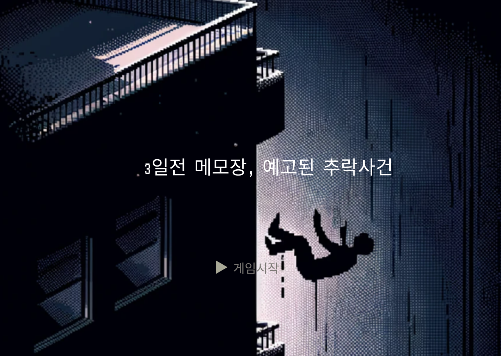
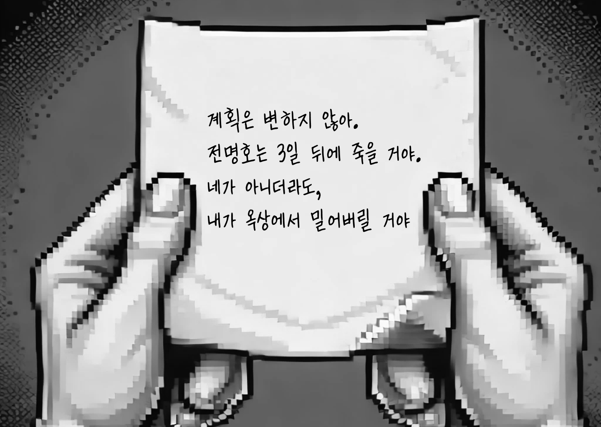

# Memo from 3 Days Ago
### A Foretold Fall: Memo from 3 Days Ago

---

## 📖 Project Overview
"Memo from 3 Days Ago" is a story-driven game combining elements of mystery and puzzles.  
Players explore various scenes, collect clues, and make decisions to uncover the truth behind the incident.  
Every choice influences the story’s progression and its ending, providing an immersive experience.

<br>
<br>

---


## 🎯 Motivation
This project stemmed from a passion for merging interactive storytelling with gaming.  
We wanted to create a game where players’ choices have a tangible impact on the outcome.  
Additionally, it served as an opportunity to challenge ourselves technically and grow through collaborative creativity.

<br>
<br>

---
## 🚀 Key Features
- **Engaging Story**: A dynamic narrative that adapts to players' choices, leading to multiple endings.
- **Interactive Decisions**: Real-time decision-making influences the game’s direction.
- **Custom Soundtrack**: Background music that enhances immersion.
- **Explorative Gameplay**: Discover clues and advance the story through exploration and choices.

<br>
<br>

---


## 🖼️ Screenshots




<br>
<br>

---

## 🛠️ Installation and Setup
### 1. Download the Project
Clone or download the repository:
```
git clone https://github.com/HUMBLE25/Memo_from_3Days_Ago.git
```
### 2. Open the Project in IntelliJ IDEA
   Launch IntelliJ IDEA and click on Open.  
   Select the cloned project folder.
### 3. Install Required Library
   This project uses the JLayer library for MP3 playback. Follow these steps to set it up:

1. Download jlayer.jar from JLayer GitHub.
2. In IntelliJ IDEA, navigate to File > Project Structure > Libraries.
3. Click the ```+``` button and add the jlayer.jar file.
4. Click Apply and ```OK``` to save the changes.

### 4. Run the Game 
Main.java file to start the game.

<br>
<br>

---
## 🎮 How to Play
- Use the mouse to interact with objects and make choices.
- Your decisions will influence the game’s ending.
- Explore various story routes to uncover the truth.

<br>
<br>

---
## 👨‍💻 Team Members
- Project Duration: 6 weeks
- Team Members 
  - Jinkyum Kim 
    - Roles:
      - Team Leader, Overall Project Management, Meetings & Schedule Coordination, 
      - Story Planning Development of Stage1,2 and partial development of Ending, Stage3,4  
      - Wireframe Participation
    - GitHub: github.com/HUMBLE25
  - Seyeon Kim
    - Roles:
      - Story Manager, Wireframe Design, Presentation
      - Ending Development
    - GitHub: github.com/snowball03
  - Beomgeun Park
    - Roles:
      - Wireframe Design, Story Planning
      - Development of Stage3,4, Gameplay Video Production
    - GitHub: github.com/ping9pang
  - Kyobong Moon
    - Roles:
       - Wireframe Design, Story Planning
       - Opening Development, Presentation Slides
    - GitHub: github.com/Keobon

<br>
<br>

---
## 🙏 Additional Information & Acknowledgements
- JLayer Library: Provides MP3 playback functionality.
- FreeSound.org: Sound effect resources.
- A huge thanks to everyone who supported us in completing this project!

<br>
<br>

---
## ⚠️ Disclaimer
This project is not for distribution and is intended for educational and learning purposes only.
It was created solely for academic and research objectives.
